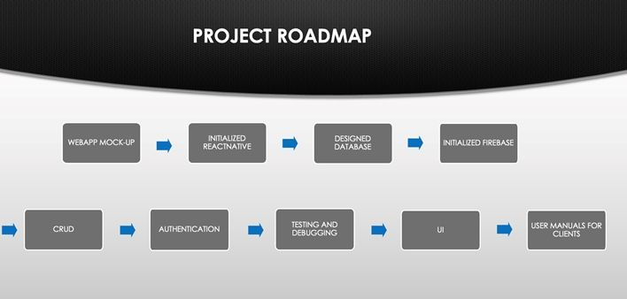
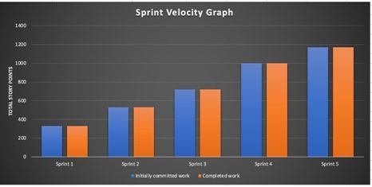
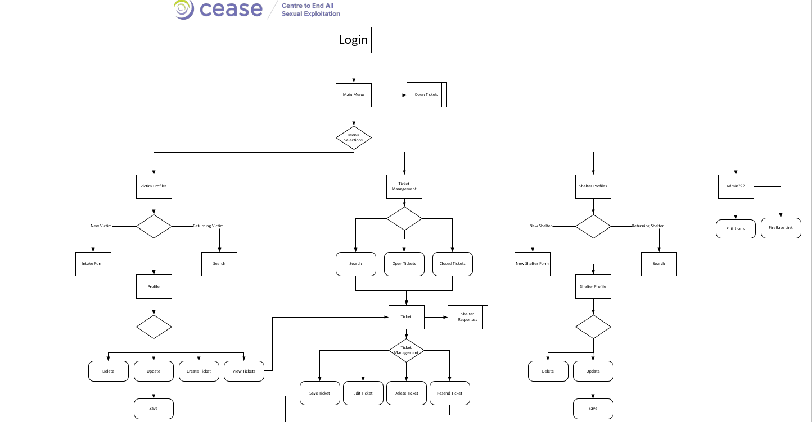

# Copy of Safe Shelter Capstone Project Repository

**NOTE:** This is a copy of the original code that was delivered to the client and I am using this code upon taking permission from my client and the development team for demonstration purposes only. However, I do not have access to the Firebase project that is originally set up for the client, so I created a dummy Firebase project on my end and hooked up the operational code with the dummy project.

**The web application is also hosted at my dummy firebase project and can be accessed [here](https://dummy2-42255.web.app/)**.

**Login credentials of a dummy agent: 
Email: dummyuser@gmail.com 
Password: dummyuser**
 
 

**Login credentials of a dummy shelter: 
Email: mencare@login.ca 
Password: mencare
 
Email: mencare2@login.ca 
Password: mencare2
 

## Introduction
This web application is a product produced by a team of 9 students on a Capstone project using Scrum Project Methodology. The project team worked with CEASE and the Safer Way Out partnership (funded by Public Safety Canada) to design and create a web application from scratch. The purpose of the application is to support workers to assist sexually exploited and trafficked persons in danger to find safe shelter across Alberta. The web application is built in Node.js, following React.js JavaScript framework and hosted in Firebase Hosting. We used Firebase Realtime Database to meet the database needs and Firebase Authentication for the security needs of our application.

The project was completed in 5 sprints and the project roadmap is displayed below: 

 
Sprint Velocity Graph: 
 

Current RTDB structure: [Click here](RTDB.json)

## Description of the application
 

  
Upon opening the application, user will be prompted to login. All the other sites of the app are protected and can not be accessed until and unless user is authenticated. There are two kinds of valid users in this app. One is a CEASE agent and the other is a Shelter. We are using the email address as the primary key to identify the kind of user upon login. If user is an agent, then app will redirect to the CEASE view or if user is a shelter, then app will redirect to the Shelter View.

An agent can create, read, update, delete (CRUD) client profiles, shelter profiles, and incident tickets. Tickets are issued to one or more shelters and a particular shelter can respond to one or more incident tickets sent from the agent(s). The application has a ticket filtering system, that helps in sending ticket requests to a list of filtered shelters that can accomodate specific needs of a particular client. For example, a male client's request will not go to a shelter that is female-only or a client request with mental disorder will go forward to a shelter that accepts clients with mental disorder etc. There are various other filters available in the application.

The response taken from shelters is either an ACCEPT or REJECT (binary response) and the response is displayed in individual incident tickets from the agent's view. If ticket has at least one yes from any shelters, then the ticket instance will be indicated as green to the agent in the home screen of the agent's view. To see all the acceptances and rejections from all shelters in detail, it is displayed if we enter inside the ticket instance.

After receiving sufficient response for a particular incident ticket, agent can either keep the ticket open or close it as resolved.

An agent can create more shelter profiles and update agent profile's password from the admin page if needed. Shelters only have the ability to update their profile's password from their view.

All the pages of the application are styled independantly using React CSS styles.

## Contributors of the application
- Nathan Humphrey (Instructor acting as the Project Coordinator)
- Ramandeep Kaur (Business Analyst student)
- Sheikh Anika Tahsin (Business Analyst student)
- Braydon Tol (Software Developer student)
- Zahid Bin Amin (Software Developer student)
- Greg Frieson (Software Developer student)
- Ashley Olthoff (Software Developer student)
- Farzeen Shoaib (Software Developer student)
- Riley Bourque (Software Developer student)
- Anton Slone (Software Developer student)
